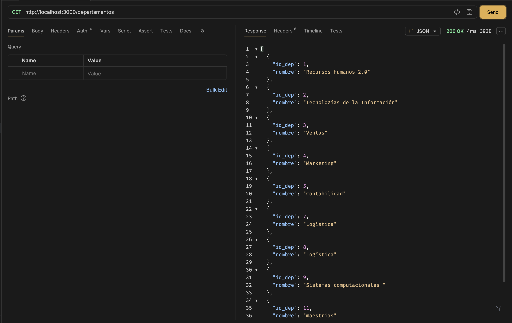
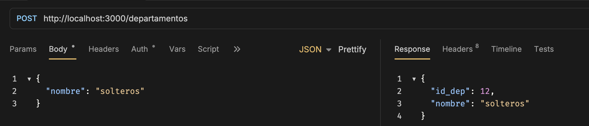
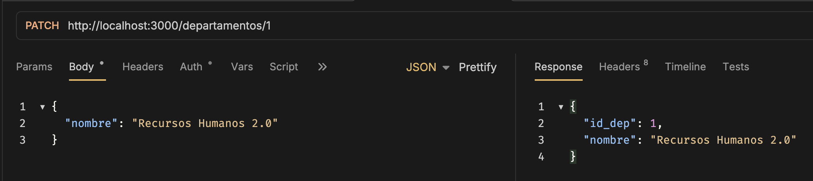
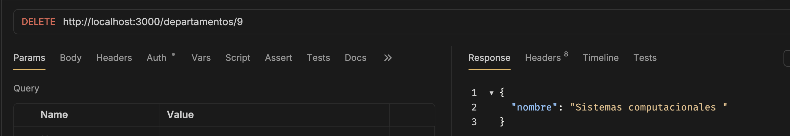

# Backend (NestJS)

## 3.1 Instalación

Entrar a la carpeta:

```bash
cd backend
```

Instalar dependencias:

```bash
npm install
```

---

## 3.2 Ejecución del servidor

```bash
npm run start:dev
```

Servidor:

```
http://localhost:3000
```

---

## 3.3 Librerías utilizadas

| Librería | Versión aproximada | Propósito |
|----------|--------------------|-----------|
| @nestjs/core | 11.x | Núcleo del framework NestJS |
| @nestjs/common | 11.x | Decoradores y funcionalidades principales |
| @nestjs/typeorm | 11.x | Integración con TypeORM |
| typeorm | 0.3.x | Manejo de entidades y consultas SQL |
| mysql2 | 3.x | Driver de conexión MySQL |
| class-validator | 0.14.x | Validación de datos |
| class-transformer | 0.5.x | Transformación de objetos |

---

## 3.4 Arquitectura Backend

El backend utiliza una arquitectura modular organizada por funcionalidades.

```
src/
├── departamentos
│   ├── controller
│   ├── service
│   └── entity
│
├── empleados
│   ├── controller
│   ├── service
│   └── entity
│
└── tareas
    ├── controller
    ├── service
    └── entity
```

---

## 3.5 Implementación Avanzada Backend

Se implementó validación global mediante **ValidationPipe**, lo que permite:

- Validar la información enviada por el cliente.
- Evitar datos inválidos.
- Transformar automáticamente los tipos de datos.
- Mantener la integridad durante las operaciones CRUD.

Configuración utilizada:

```typescript
app.useGlobalPipes(
  new ValidationPipe({
    whitelist: true,
    forbidNonWhitelisted: true,
    transform: true,
  }),
);
```

---

## Evidencias de funcionamiento de la API

### GET /departamentos



### POST /departamentos



### PATCH /departamentos



### DELETE /departamentos

