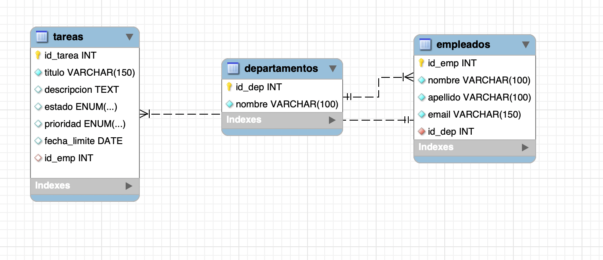
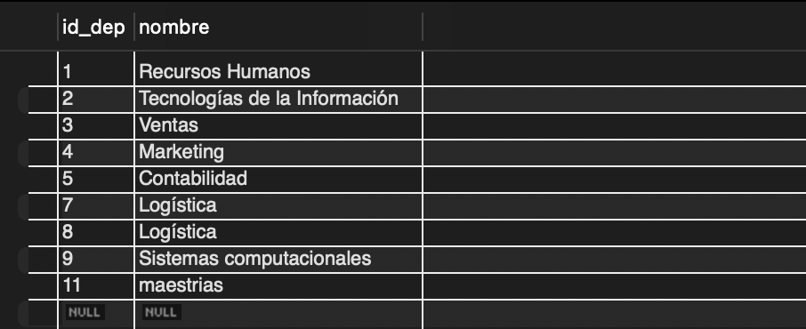
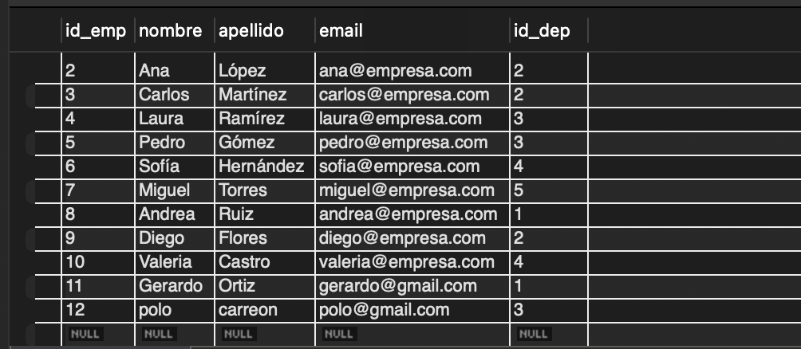
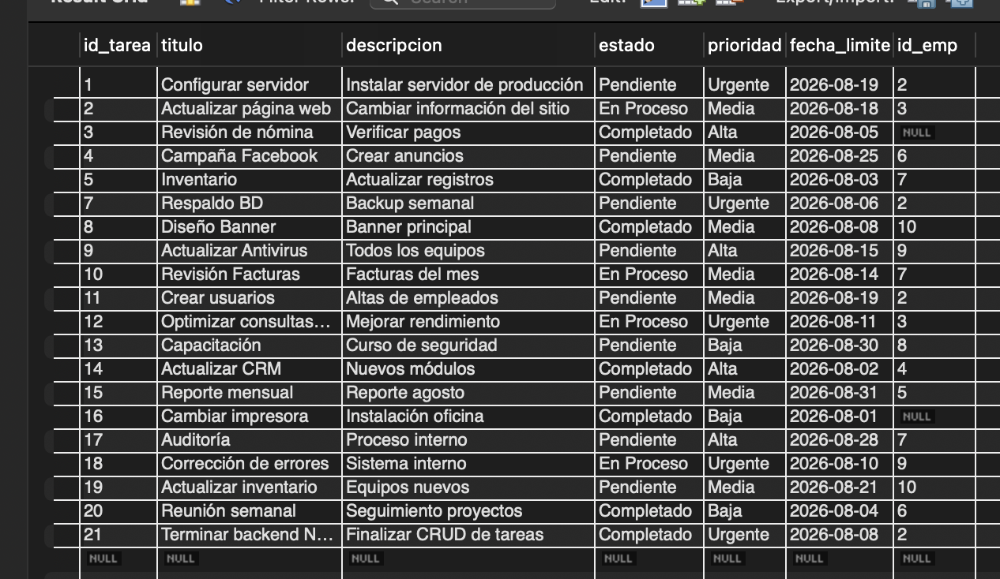

# Base de Datos

## 2.1 Modelo Relacional

La base de datos está conformada por tres tablas principales.

### Diagrama Entidad-Relación



---

### Tabla: departamentos

| Campo | Tipo | Descripción |
|------|------|-------------|
| id_dep | INT | Llave primaria |
| nombre | VARCHAR | Nombre del departamento |

---

### Tabla: empleados

| Campo | Tipo | Descripción |
|------|------|-------------|
| id_emp | INT | Llave primaria |
| nombre | VARCHAR | Nombre del empleado |
| apellido | VARCHAR | Apellido del empleado |
| email | VARCHAR | Correo electrónico |
| id_dep | INT | Llave foránea hacia departamentos |

**Relación:**

departamentos **1 → N** empleados

Un departamento puede tener varios empleados.

---

### Tabla: tareas

Administra las actividades asignadas a los empleados.

| Campo | Tipo | Descripción |
|------|------|-------------|
| id_tarea | INT | Llave primaria |
| titulo | VARCHAR | Nombre de la tarea |
| descripcion | TEXT | Detalle de la actividad |
| estado | VARCHAR | Estado actual |
| prioridad | VARCHAR | Nivel de importancia |
| fecha_limite | DATE | Fecha límite |
| id_emp | INT | Empleado asignado |

**Relación:**

empleados **1 → N** tareas

Un empleado puede tener múltiples tareas asignadas.

---

## 2.2 Integridad Referencial

La base de datos utiliza:

- Llaves primarias.
- Llaves foráneas.
- Restricciones NOT NULL.
- Relaciones uno a muchos.

Ejemplo:

```sql
FOREIGN KEY(id_emp)
REFERENCES empleados(id_emp);
```

---

## Evidencias de la Base de Datos

### Tabla Departamentos



### Tabla Empleados



### Tabla Tareas

