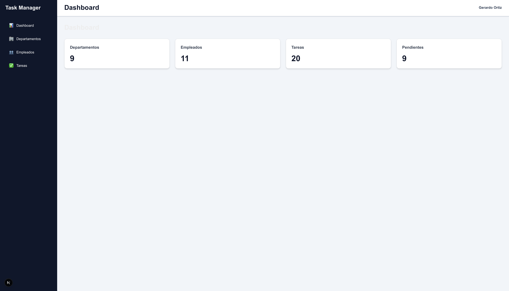
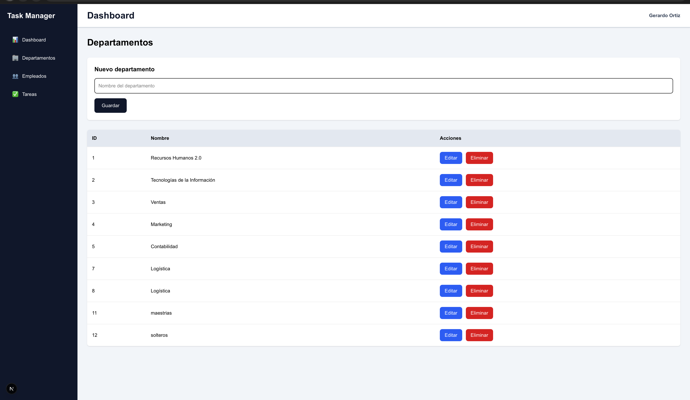
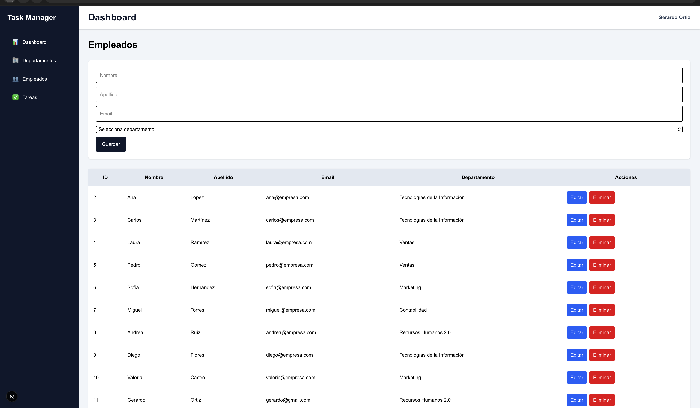
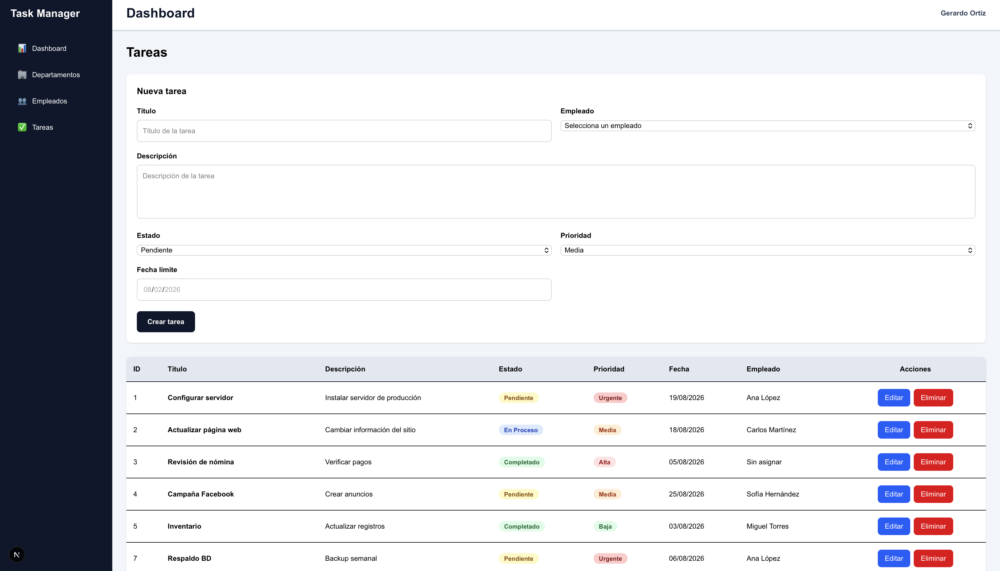

# Frontend (Next.js)

## 4.1 Instalación

Entrar a la carpeta:

```bash
cd frontend
```

Instalar dependencias:

```bash
npm install
```

---

## 4.2 Ejecución

Modo desarrollo:

```bash
npm run dev
```

Compilar para producción:

```bash
npm run build
```

---

## 4.3 Librerías utilizadas

| Librería | Versión | Uso |
|----------|---------|-----|
| Next.js | 16.x | Framework frontend basado en React |
| React | 19.x | Construcción de componentes |
| Tailwind CSS | 4.x | Diseño de la interfaz |
| TypeScript | 5.x | Tipado estático |
| Lucide React | Última | Iconografía |

---

## 4.4 Funcionalidades Frontend

El sistema cuenta con los siguientes módulos:

- Dashboard principal.
- Gestión de departamentos.
- Gestión de empleados.
- Gestión de tareas.

Operaciones disponibles:

- Crear
- Consultar
- Editar
- Eliminar

---

## Evidencias de la interfaz

### Dashboard



### Módulo Departamentos



### Módulo Empleados



### Módulo Tareas

